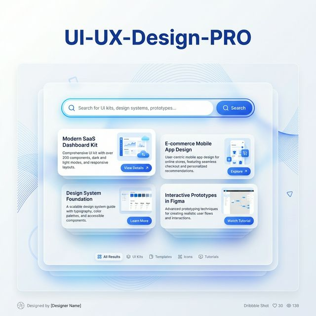
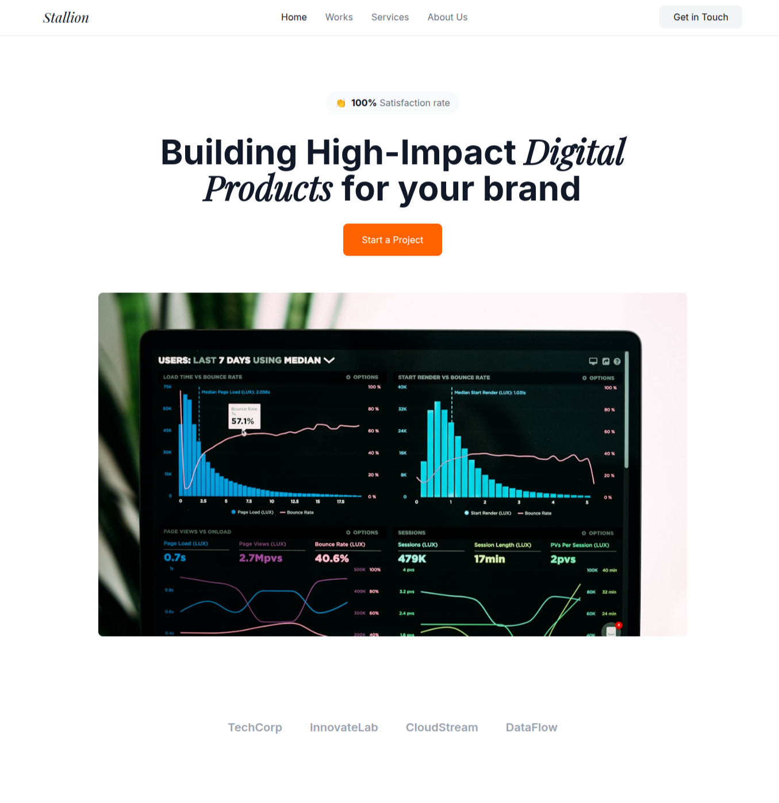
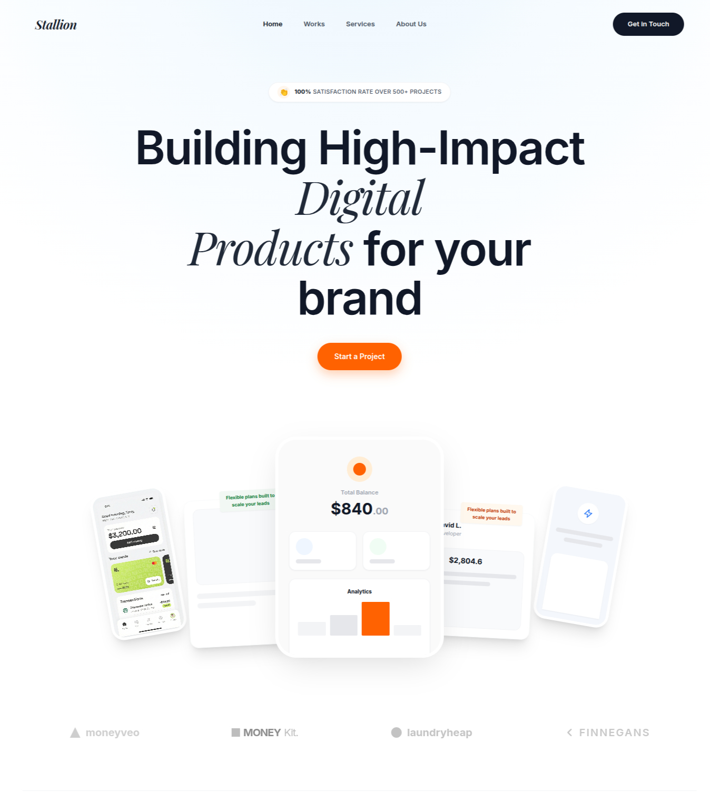
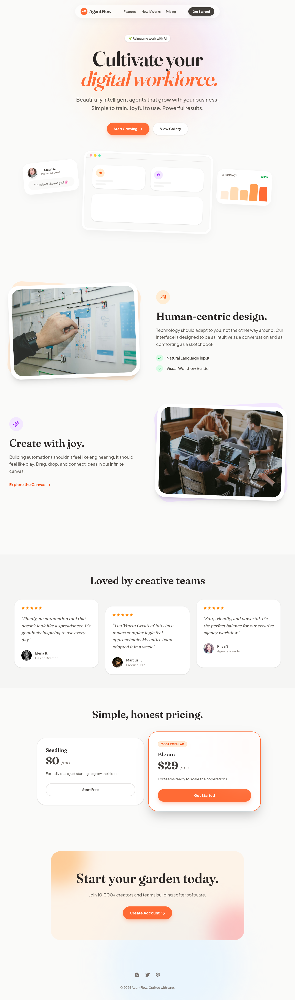
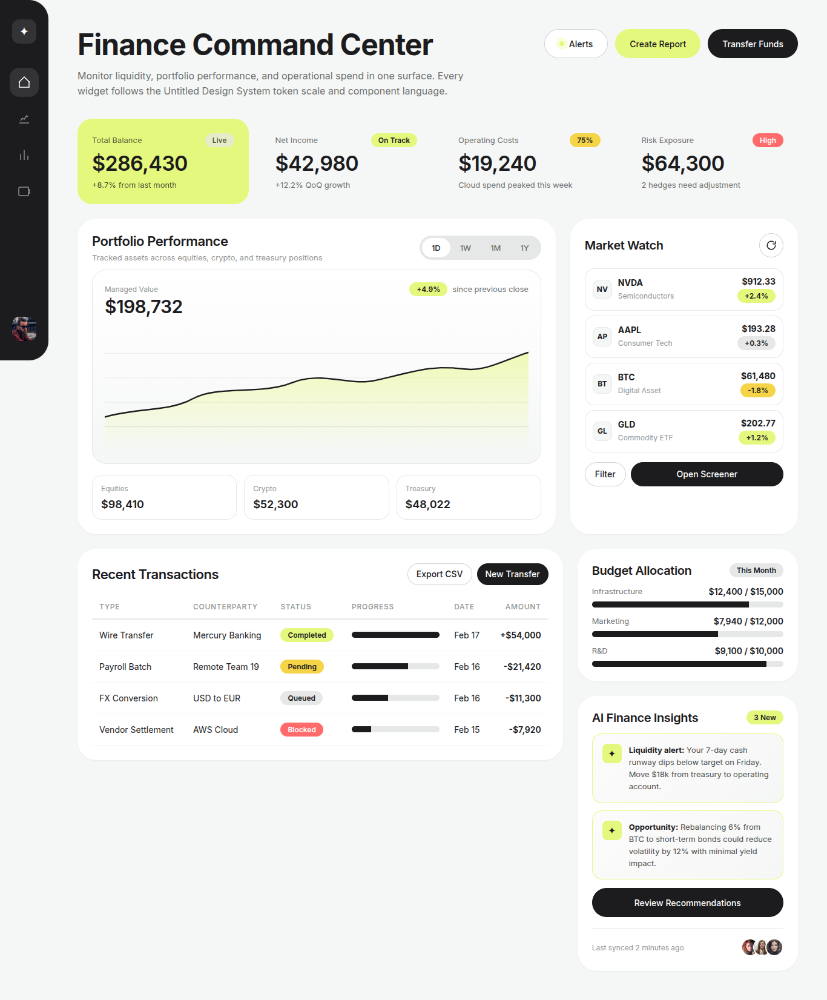

# 🎨 UI/UX Design Pro Skill (2026 Edition)


[](LICENSE)

A senior-level AI skill that provides data-driven design intelligence for building premium, production-grade UI/UX across multiple platforms and frameworks. Powered by a **blazing fast Bun CLI**, **Orama Search Engine**, **16 tech stacks**, and **1,875+ data rows**.

## Highlights

- **107+ UI Styles** — Glassmorphism, Liquid Glass, Data Brutalism, Spatial UI, Cyberpunk, AI-Native, and 100+ more
- **Architectural Palettes** — 11-step (50-950) color scales with semantic variations (Neutral, Success, Warning, Error)
- **107+ Font Pairings** — Curated typography combinations with Google Fonts imports and mood keywords
- **127+ Color Palettes** — Industry-specific palettes for SaaS, Fintech, Healthcare, E-commerce, Beauty, and more
- **150+ Reasoning Rules** — Industry-specific design system generation with anti-patterns
- **150+ UX Guidelines** — Best practices covering accessibility, animation, forms, and more
- **Developer-Ready Output** — Generates React/Tailwind code snippets and WCAG accessibility notes
- **16 Tech Stacks** — React, Next.js, Vue, Nuxt.js, Angular, Remix, SolidJS, Svelte, Astro, and more
- **Unified CLI** — Search, audit, icons, and generation tools in a single TypeScript application
- **11 Reference Docs** — Intent-first design methodology

## Recommended Models

For best results, use **GPT-5.3 Codex xhigh** or **Gemini 3.0 Pro**.

## Prerequisites

| Requirement | Version | Purpose                                            |
| ----------- | ------- | -------------------------------------------------- |
| **Bun**     | 1.0+    | Required runtime for the CLI and Orama search engine |


### Install Bun

```bash
# macOS / Linux / WSL
curl -fsSL https://bun.sh/install | bash

# Windows (PowerShell)
powershell -c "irm bun.sh/install.ps1 | iex"
```

## Installation

### Quick Install (Recommended)

```bash
npx skills add https://github.com/saifyxpro/ui-ux-design-pro-skill --skill ui-ux-design-pro
```

### Manual Installation

```bash
# Clone the repository
git clone https://github.com/saifyxpro/ui-ux-design-pro-skill.git
cd ui-ux-design-pro-skill

# Install dependencies
cd skills/ui-ux-design-pro/cli
bun install
```

## Before & After

See the difference the skill makes — same prompt, with and without UI/UX Design Pro:

### Landing Page (Example 01)

| Without Skill | With Skill |
| :---: | :---: |
|  |  |
| Generic layout, basic colors, default spacing | Premium typography, refined palette, professional hierarchy |

### SaaS Landing Page (Example 02) — One-Shotted with Skill

Generated in a single prompt using the skill's design system CLI + "Warmth & Approachability" direction:

<details>
<summary><b>View Generated Result (One-Shot)</b></summary>



> **Prompt:** _"Generate a Warm Creative SaaS landing page using the design CLI"_
>
> **Design Direction:** Warmth & Approachability · **Primary:** `#FF6B35` (Coral) · **Fonts:** Fraunces + Plus Jakarta Sans · **Radius:** 24-32px

</details>

### Finance Command Center (Example 03)

<details>
<summary><b>View Generated Result</b></summary>



> **Prompt:** _"Generate a Finance Command Center dashboard"_
>
> **Design Direction:** Precision & Density · **Primary:** `#C2E045` (Lime) · **Font:** Inter · **Radius:** 16-24px

</details>

## Features

### Intelligent Design System Generation

The flagship feature is the **Design System Generator** — an AI-powered reasoning engine that analyzes your project requirements and generates a complete, tailored design system in **Beautiful Markdown**.

```markdown
# Design System: SaaS Launch

> **Query**: "Modern SaaS Platform" | **Tech Stack**: Next.js | **Generated**: 2/18/2026

## 1. Brand Identity
- **Primary Color**: `#7C3AED` (Violet)
- **Typography**: **Inter** (Headings & Body)

## 2. Component Library

### Primary Button
**Usage:** Main call-to-action actions
**Variants:** Default, Hover, Active, Disabled
**CSS Variable:** `--radius-md`

> [!TIP]
> **Best Practice**: Use only one primary button per screen to maintain clear hierarchy.

> [!NOTE]
> **Accessibility**: Ensure 4.5:1 contrast. Use `aria-label` if icon-only.

```tsx
<button className="bg-violet-600 hover:bg-violet-700 text-white px-6 py-2 rounded-lg font-medium transition-colors focus:ring-2 focus:ring-violet-300">
  Get Started
</button>
```

### Hero Section
**Usage:** Top of landing page
**Variants:** Centered, Split, With Image

> **Description**: A high-conversion hero with clear value proposition and social proof.
```

### How It Works

```text
┌─────────────────────────────────────────────────────────────────┐
│  1. USER REQUEST                                                │
│     "Build a fintech analytics dashboard"                       │
└─────────────────────────────────────────────────────────────────┘
                              │
                              ▼
┌─────────────────────────────────────────────────────────────────┐
│  2. ORAMA SEARCH ENGINE (Sub-50ms)                              │
│     • Product type matching (96 categories)                     │
│     • Style recommendations (107 styles)                        │
│     • Color palette selection (127 palettes)                    │
│     • Typography pairing (107 font combinations)                │
│     • Industry reasoning (131 rules)                            │
│     • UX guidelines (129 guidelines)                            │
│     • Tech stack guidelines (16 frameworks)                     │
└─────────────────────────────────────────────────────────────────┘
                              │
                              ▼
┌─────────────────────────────────────────────────────────────────┐
│  3. MARKDOWN OUTPUT                                             │
│     Brand Identity + Architectural Color Palettes (50-950)      │
│     + Typography Scale (px/rem) + Tech Stack Guidelines         │
└─────────────────────────────────────────────────────────────────┘
```

### Unified CLI

All features are accessible via the `bun run` command:

| Command    | Purpose                                              |
| ---------- | ---------------------------------------------------- |
| `search`   | Orama fuzzy search across all 11 design databases    |
| `generate` | Full design system generator (Markdown/JSON output)  |
| `icons`    | Search popular icon libraries and get CDN links      |
| `audit`    | UI code quality and accessibility auditor (12 rules) |

### 107 UI Styles

<details>
<summary><b>View All Styles</b></summary>

| #   | Style                    | Best For                                   |
| --- | ------------------------ | ------------------------------------------ |
| 1   | Minimalism & Swiss Style | Enterprise apps, dashboards, documentation |
| 2   | Neumorphism              | Health/wellness apps, meditation platforms |
| 3   | Glassmorphism            | Modern SaaS, financial dashboards          |
| 4   | Brutalism                | Design portfolios, artistic projects       |
| 5   | 3D & Hyperrealism        | Gaming, product showcase, immersive        |
| 6   | Vibrant & Block-based    | Startups, creative agencies, gaming        |
| 7   | Dark Mode (OLED)         | Night-mode apps, coding platforms          |
| 8   | Accessible & Ethical     | Government, healthcare, education          |
| 9   | Claymorphism             | Educational apps, children's apps, SaaS    |
| 10  | Aurora UI                | Modern SaaS, creative agencies             |
| ... | _+ 97 more styles_       | See `data/styles.csv` for full list        |

Includes: Liquid Glass, Aurora Borealis, Data Brutalism, Cyberpunk UI, Organic Biophilic, AI-Native UI, Spatial UI (VisionOS), Chromatic Aberration, Interactive Cursor Design, Voice-First Multimodal, and 30+ more.

</details>

## Usage

### CLI Commands

All scripts are accessible via the generated CLI.

```bash
# Search across all design databases
bun run skills/ui-ux-design-pro/cli/index.ts search "SaaS dashboard" --domain style

# Search for icons
bun run skills/ui-ux-design-pro/cli/index.ts icons "arrow"

# Generate full design system (Markdown)
bun run skills/ui-ux-design-pro/cli/index.ts generate "fintech dashboard" --stack nextjs --output design.md


# Audit UI code quality
bun run skills/ui-ux-design-pro/cli/index.ts audit src/App.tsx
```

## Verification & Testing

To verify the audit command detects modern AI hallucinations, run the included test suite:

- **Fail Test**: `bun run skills/ui-ux-design-pro/cli/index.ts audit test/audit_fail.tsx` (Expect errors) -> [See Report](output/audit_fail.md)
- **Pass Test**: `bun run skills/ui-ux-design-pro/cli/index.ts audit test/audit_pass.tsx` (Expect success) -> [See Report](output/audit_pass.md)

### Expected Output (Fail)

```text
🔴 L5 [AI001] Tailwind interpolation detected
🟡 L9 [AI005] Hallucinated utility "text-shadow"
🟡 L12 [AI008] Low contrast pseudo-transparency
🟡 L18 [AI013] h-screen causes layout shifts
🟡 L21 [AI015] target="_blank" validation missing
```

### Token Presets

Included in the generation logic:

| Preset       | Primary | Font             | Radius |
| ------------ | ------- | ---------------- | ------ |
| `fintech`    | #2563EB | Inter            | 8px    |
| `healthcare` | #059669 | Source Sans Pro  | 12px   |
| `ecommerce`  | #DC2626 | Poppins          | 8px    |
| `saas`       | #7C3AED | Inter            | 12px   |
| `education`  | #2563EB | Nunito           | 16px   |
| `gaming`     | #EF4444 | Orbitron         | 4px    |
| `luxury`     | #1E293B | Playfair Display | 0px    |
| `startup`    | #8B5CF6 | DM Sans          | 12px   |

## Architecture

```text
ui-ux-design-pro-skill/
├── skills/                     # AI Skill Definitions
│   └── ui-ux-design-pro/
│       ├── cli/                # Unified CLI (Bun/TypeScript)
│       │   ├── index.ts        # Entry point
│       │   ├── commands/       # Search, Generate, Audit, Icons
│       │   ├── lib/            # Orama search, formatters
│       │   └── data/           # 27 CSV databases (1,875+ rows)
│       ├── SKILL.md            # Main prompt instructions
│       └── references/         # 11 design methodology docs
├── test/                       # Verification tests
├── examples/                   # Before/After examples
├── public/                     # Static assets
├── .gitignore
├── LICENSE
└── README.md
```

## License

This project is licensed under the [MIT License](LICENSE).
